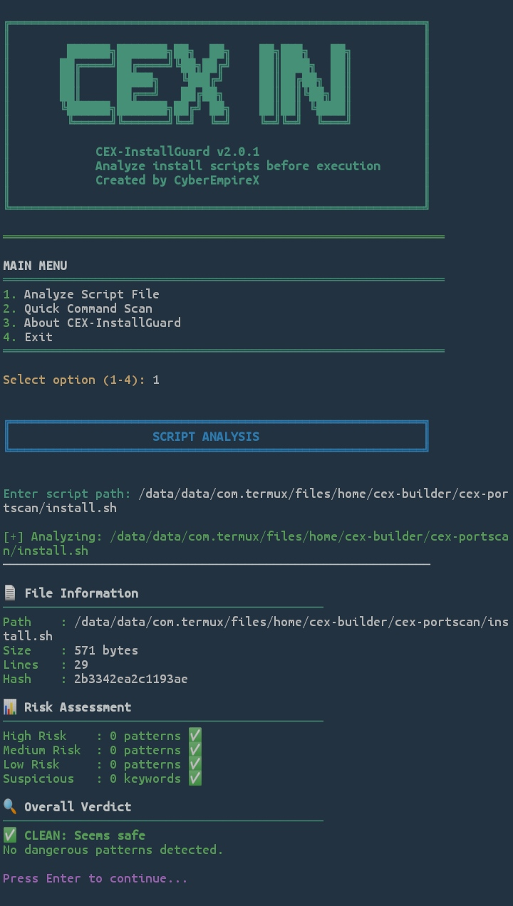
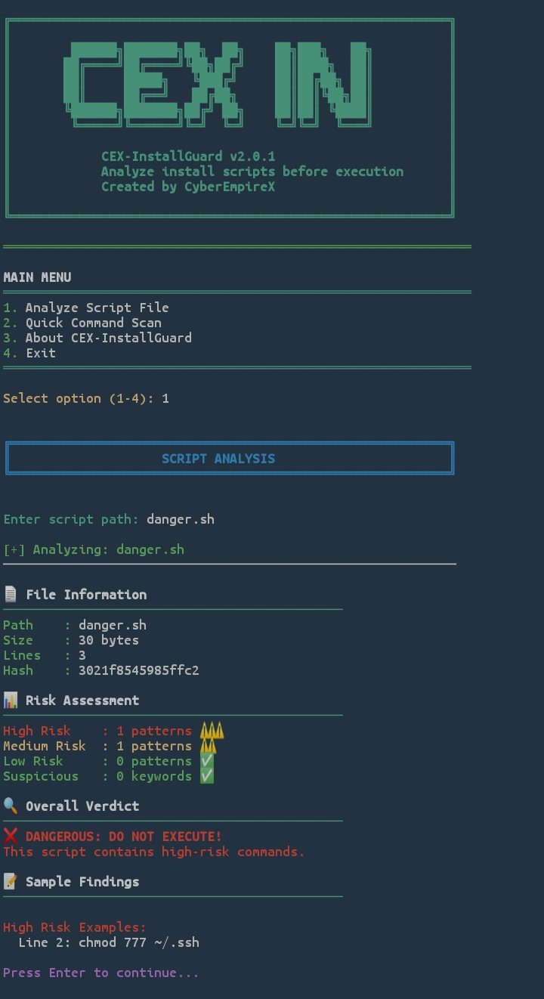

# CEX-InstallGuard 🔐  
Analyze install scripts before you execute them.

CEX-InstallGuard is a **Termux-first security analysis tool** that helps you inspect shell scripts, install scripts, and command sequences **before running them**.

Built for people who value **safety, transparency, and control**.


## 🚀 Why CEX-InstallGuard Exists

Many Termux users blindly run commands like:

```bash
curl something | bash

This tool exists to answer one question before damage happens:

> “Is this script safe to run?”


## 🛡️ Features

✔ Analyze shell scripts without executing them
✔ Detect high-risk commands (rm -rf, chmod 777, privilege abuse)
✔ Classify risks into High / Medium / Low
✔ Show exact line numbers of dangerous commands
✔ Offline-first (no internet required)
✔ Designed for low-end Android phones
✔ Simple menu-based interface
✔ Ethical & defensive by design




## 📦 Tool Information

Field	Value

Tool Name	CEX-InstallGuard
Version	v2.0.1
Platform	Termux (Android)
Language	Python 3
License	MIT
Author	CyberEmpireX


## ⚙️ Installation (Termux)

#1️⃣Install  dependencies

pkg update && pkg upgrade
pkg install python git

#2️⃣ Clone repository

git clone https://github.com/cyberempirex/cex-installguard.git
cd cex-installguard

#3️⃣ Make executable

chmod +x installguard.py

#4️⃣ Run tool

python installguard.py


## 🧪 Usage Examples

🔍 Analyze a script file

Option: 1
Enter script path: install.sh

🔎 Analyze a full path

/data/data/com.termux/files/home/tool/install.sh

## ⚠️ Dangerous script example

chmod 777 ~/.ssh
rm -rf /

The tool will flag it immediately.


## 🧠 How It Works (Simple Explanation)

1. Reads the script as text


2. Calculates file hash


3. Counts lines & size


4. Scans for known dangerous patterns


5. Scores risk level


6. Shows a clear verdict


🚫 It never executes the script.


## 📜 About CyberEmpireX

CyberEmpireX focuses on:

Ethical hacking education

Defensive cybersecurity tools

Practical learning for low-resource users


🌐 Website: https://cyberempirex.com (upcoming)
💬 Telegram: https://t.me/CyberEmpireXChat
🐙 GitHub: https://github.com/cyberempirex


# ⚠️ Legal & Ethics Notice

This tool is for:

✔ Educational use
✔ Defensive analysis
✔ Scripts you own or trust

❌ Not for illegal activity
❌ Not for attacking systems

You are responsible for how you use this tool.


# 📈 Future Roadmap

CLI mode (cex-installguard file.sh)

Export scan reports (JSON / TXT)

URL script fetching

Integration with CEX Builder

Risk score visualization


## 📄 License

MIT License
You are free to use, modify, and distribute with credit.


Think before you run.
Security starts with awareness. 🔐
